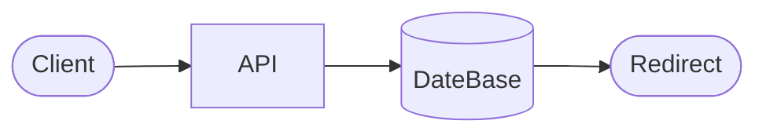

# 01_Project Overview

## Professional overview

The **URL Shortener API** is a backend service that generates shortened URLs and redirects users to the original URLs using unique short codes,

## Purpose of the API

- Provide a stable endpoint to **create short URLs** for any valid long URL.
- Provide a fast **redirect endpoint** used by browsers and applications.
- Enforce **time-based expiration (10 days)** to reduce storage growth and limit stale links.

## High-level backend architecture (overview)

- HTTP API built with **Express.js** and structured using controllers + services.
- Persistence in **MongoDB**, accessed via **Prisma ORM** for type-safe queries.
- Deployment on **Vercel** with environment-based configuration.

### Diagram placeholder

## Main features

- **URL shortening**
    - Accept a long URL and return a `shortCode` + `shortUrl`.
- **URL redirection**
    - Resolve `shortCode` to `originalUrl` and redirect.
- **Expiration after 10 days**
    - Persist `expiresAt` and block redirects after expiration.
- **Collision prevention**
    - Ensure `shortCode` is unique with database constraints + retry logic.
- **API testing**
    - Automated tests with **Jest**
    - Manual verification/collections with **Postman**.
- MongoDB storage
    - 
- **Deployment**
    - CI-ready via **GitHub**, deployed to **Vercel**, hosted DB via **MongoDB Atlas**.