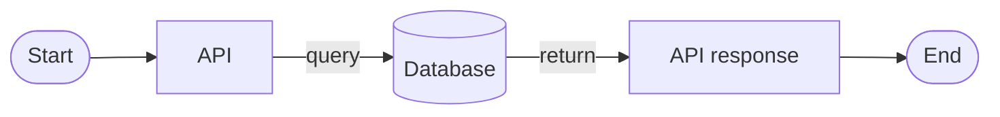
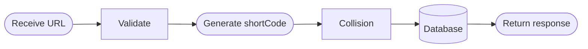
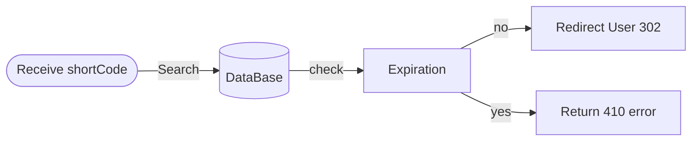

# 03_API_Endpoints

## Conventions

- Base URL: `BASE_URL` (e.g., `http://localhost:3000`)
- JSON responses for creation endpoints.
- Redirect responses for `GET /:shortCode`.

## Example flow



---

# POST /shorten

## Purpose

Create a short URL mapping for an `originalUrl` with a fixed 10-day expiration.

## Request body

```json
{
  "originalUrl": "https://google.com/"
}
```

## Response body (success)

```json
{
  "shortCode": "ab12cd",
  "shortUrl": "https://localhost:3000/ab12cd",
  "expiresAt": "2026-05-30T10:00:00Z"
}
```

## Validation

- `originalUrl` must be present.
- Must be a valid URL with protocol (`http://` or `https://`).

## Status codes

- `201 Created`
- `400 Bad Request`
- `500 Internal Server Error`

## Business logic flow



### Notes

- The controller handles HTTP concerns.
- The service implements generation + collision retry.

---

# GET /:shortCode

## Purpose

Redirect the client to the original URL for the provided `shortCode`.

## Redirect behavior

- If the short URL is valid and not expired: respond with `302` and `Location: <originalUrl>`.

## Expiration checks

- If `now > expiresAt`, the mapping is considered expired and should not redirect.

## Error handling

- If no record exists: return `404 Not Found`.
- If record exists but expired: return `410 Gone`.

## Status codes

- `302 Redirect`
- `404 Not Found`
- `410 Gone`

## Redirect flow

Receive shortCode → Search DB → Check expiration → Redirect user or return error



- File:  `UrlController.js`
    
    ```jsx
    import { createShortUrl, getOriginalUrl } from "../services/urlService.js";
    
    // Controller function to handle URL shortening
    
    export async function shortenUrl(req, res) {
        try {
            const { originalUrl } = req.body || {};
    
            // Validate the original URL format
            const urlPattern = /^(https?:\/\/)[^\s/$.?#].[^\s]*$/i;
    
            // Allow POST /shorten to be used as a simple API health test.
            if (!req.body || Object.keys(req.body).length === 0) {
                return res.status(200).json({
                    message: "API is running",
                });
            }
    
            // Validate the original URL
            if (!originalUrl) {
                return res.status(400).json({ error: "Original URL is required" });
            }
    
            // Validate the URL format
            if (!urlPattern.test(originalUrl)) {
                return res.status(400).json({ error: "Invalid URL format. Please enter a valid http or https URL." });
            }
    
            // Create the shortened URL
            const shortUrl = await createShortUrl(originalUrl);
    
            return res.status(201).json({
                shortUrl: `${process.env.BASE_URL}/${shortUrl.shortCode}`,
            });
        } catch (error) {
            return res.status(500).json({
                error: "Internal server error"
            });
        }
    }
    
    export async function redirectUrl(req, res) {
        try {
            const { shortCode } = req.params;
    
            // Retrieve the original URL
            const originalUrl = await getOriginalUrl(shortCode);
    
            // If the original URL is not found, return a 404 error
            if (!originalUrl) {
                return res.status(404).json({ 
                    error: "URL not found" 
                });
            }
    
            // Check if the URL has expired
            if (new Date() > originalUrl.expiresAt) {
                return res.status(410).json({ 
                    error: "URL expired" 
                });
            }
    
            // Redirect to the original URL
            res.redirect(originalUrl.originalUrl);
        } catch (error) {
            res.status(500).json({
                error: "Internal server error"
            });
        }
    }
    
    ```
    
- File: `urlService.js`
    
    ```jsx
    import ShortUrl from "../models/ShortUrl.js";
    import { generateShortCode } from "../utils/generateShortCode.js";
    
    // Function to create a shortened URL
    export async function createShortUrl(originalUrl) {
    
        // Generate a unique short code
        //const shortCode = generateShortCode();
    
        let attempt = 0;
        let shortCode;
    
        // ** Hash-based approach **
        while (true) {
            shortCode = generateShortCode(originalUrl, attempt);
    
            // Check if the short code already exists in the database
            const existing = await ShortUrl.findOne({ shortCode });
            if (!existing) {
                break;
            }
            attempt++;
        }
    
        // Set the expiration date for the shortened URL (e.g., 10 days from now)
        const expiresAt = new Date(
            Date.now() + 10 * 24 * 60 * 60 * 1000 // Expires in 10 days
        );
    
        // Create the shortened URL in the database
        const shortUrl = await ShortUrl.create({
            originalUrl,
            shortCode,
            expiresAt
        });
    
        return shortUrl;
    }
    
    export async function getOriginalUrl(shortCode) {
        // Find the original URL by short code
        const url = await ShortUrl.findOne({ shortCode });
    
        return url;
    }
    
    ```