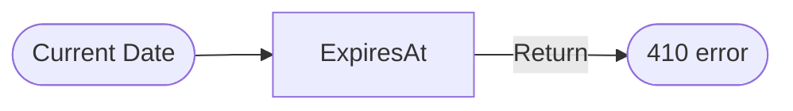

# 06_Expiration_Logic

## Requirement

All shortened URLs must expire **10 days** after creation.

## Data model

- Store expiration timestamp in `expiresAt`.
- Compute at creation time:
    - `expiresAt = createdAt + 10 days`

## Validation during redirects

Redirect endpoint must enforce:

- If `now <= expiresAt`: allow redirect.
- If `now > expiresAt`: return `410 Gone`.

## Flow example

If current date > expiresAt → Return 410 Gone



## Example

```jsx
If (new Date() > url.expiresAt) {
	return res.status(410).json({ 
		error: "Link expired"
		});
}
```