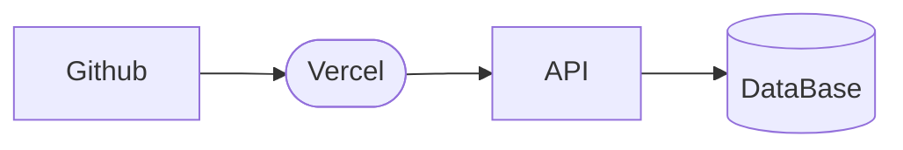

# 09_Deployment

## Deployment components

- **GitHub**: source control, pull requests, code review, optional GitHub Actions.
- **Vercel**: deploy Express API (as a serverless/edge-compatible deployment depending on configuration).
- **MongoDB Atlas**: managed MongoDB cluster.

## Deployment flow



## Operational checklist

- Confirm the MongoDB IP allowlist / network access.
- Ensure Prisma is generated during build.
- Validate that redirect responses work correctly in production domain.

## Environment variable setup (Vercel)

- Configure `DATABASE_URL`, (if required by runtime).
- Use separate environments for Preview and Production.
- env.
    
    ```sql
    DATABASE_URL=
    PORT= //Just for localhost used only
    BASE_URL=
    FRONTEND_URL=
    
    ```