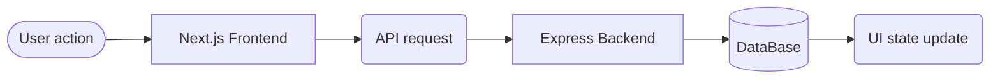

# 02_Frontend_Architecture

## Data flow

## Key decisions

- Client vs server components
- Where to place API calls
- Error boundaries and loading states

# Responsibilities

## Frontend

- Collect user input
- Validate URLs
- Display results

## Backend

- Generate short codes
- Save URLs
- Handle redirects

## Database

- Store URL records
- Store expiry dates
