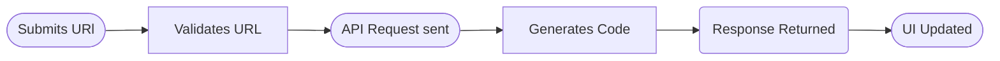

# 05_API_Integration

## Base URL

`NEXT_PUBLIC_API_URL=...`

## Endpoints used

### POST /shorten

Request:

```json
{ "originalUrl": "https://example.com" }
```

Response:

```json
{ "shortUrl": "https://.../abc123" }
```

## Integration Flow



## Client implementation notes

- Timeouts / retries (future)
- Mapping errors to UI messages
- Handling non-200 responses