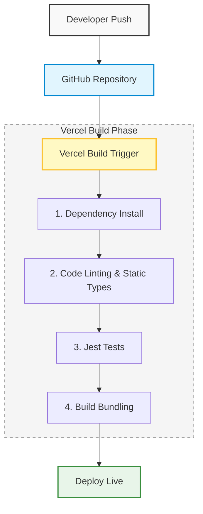

# 09 Deployment (Frontend)

This document describes the hosting architecture, environment configuration, CI/CD pipeline, and verification checklists for deploying the URL Shortener frontend application.

---

## 1. Hosting Architecture

The URL Shortener frontend is hosted on **Vercel**, which provides native optimization and serverless hosting capabilities for Next.js applications:

* **Global CDN Edge Network**: Static assets and page files are served directly from edge locations worldwide, minimizing latency.
* **Serverless Functions**: Next.js App Router API or serverless assets scale automatically without server management.
* **Preview Deployments**: Every pull request automatically spins up a sandboxed preview environment, allowing pre-merge visual validation.

---

## 2. CI/CD Integration Workflow

Our automated deployment pipeline operates via **GitHub + Vercel Integration**.

### Pipeline Lifecycle Stages
1. **Lint & Type Validation**: Runs `npm run lint` and TypeScript check (`tsc`) to block builds with syntax errors or code smell.
2. **Automated Testing**: Runs `npm run test` to verify unit and integration tests.
3. **Production Bundling**: Executes `next build`, which optimizes images, compiles styles, minifies JavaScript, and outputs static pages.

---

## 3. Environment Variables Configuration

The frontend communicates with the backend API via HTTP. The URL must be configured correctly depending on the target environment.

### Target Environment Variable
* **Name**: `NEXT_PUBLIC_API_URL`
* **Default Local Value**: `http://localhost:5000` (Defined in [`.env.local`](file:///c:/Users/trist/Downloads/URL%20Shortener%20API/frontend/.env.local))

### Production/Staging Configurations
1. **Production Environment**: Set `NEXT_PUBLIC_API_URL` to your production backend domain (e.g., `https://api.urlshortener.com`).
2. **Preview Environments**: Can be configured to connect to a staging/development backend (e.g., `https://staging-api.urlshortener.com`).

> [!IMPORTANT]
> Because this variable uses the `NEXT_PUBLIC_` prefix, it is compiled into the client-side JavaScript bundle during the build step. Make sure this variable is set **before** running the build command in the Vercel dashboard.

---

## 4. Manual Verification Checklist

Before marking a deployment as ready for production, execute the following validation steps:

* [ ] **Build Validation**: Verify that Vercel logs report a successful build exit code and output bundle analysis.
* [ ] **SSL / HTTPS Protocol**: Confirm that the frontend is loaded over HTTPS, and that the backend endpoint is also using SSL (`https://...`) to prevent mixed content blocking by web browsers.
* [ ] **Functional Round-Trip**:
  * Input a valid URL in the form.
  * Submit and verify that the loading state toggles correctly.
  * Verify that a shortened URL is generated and shown.
  * Click the copy button and check if the clipboard contains the correct output.
* [ ] **Console Inspection**: Check browser developer tools (F12) Console tab to ensure no unhandled exceptions or CORS failures are occurring.
* [ ] **Performance & Accessibility**: Run a Lighthouse or PageSpeed Insights audit to verify performance, accessibility, best practices, and SEO scores.