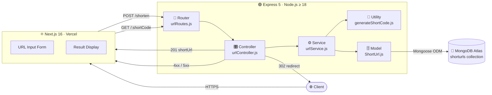
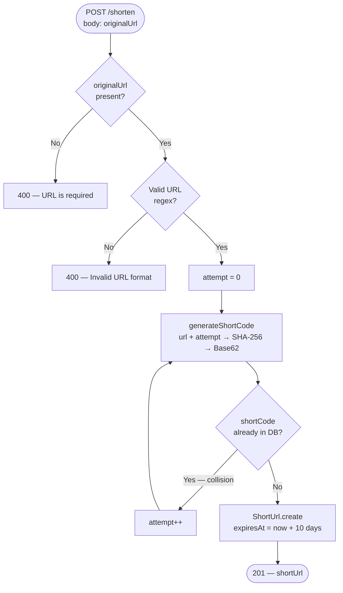
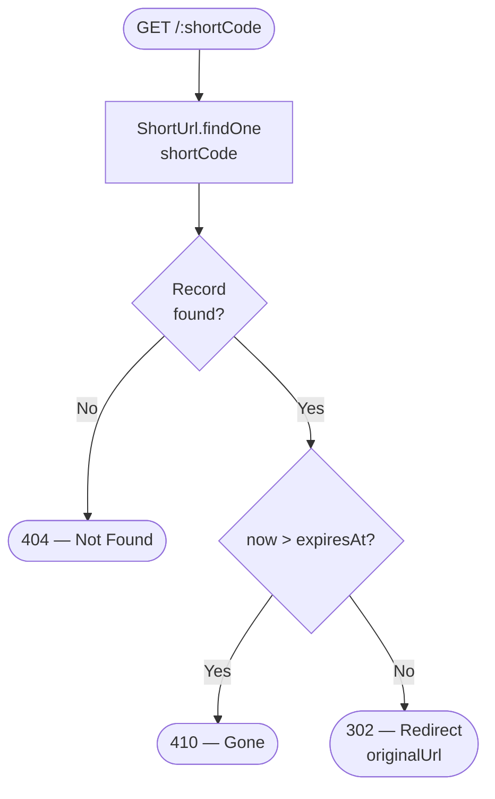

# URL Shortener API

A production-ready **URL shortening service** built with **Node.js**, **Express 5**, and **MongoDB Atlas**. Generates deterministic 6-character Base62 short codes via SHA-256 hashing with built-in collision resolution, TTL-based link expiry, and a Next.js frontend dashboard.

[](https://nodejs.org)
[](https://expressjs.com)
[](https://www.mongodb.com/atlas)
[](https://nextjs.org)

---

## Overview

The URL Shortener API accepts a long URL via `POST /shorten`, generates a unique 6-character code using a **Base62-encoded SHA-256** hash, persists it to MongoDB, and returns a fully-qualified short URL. Short codes resolve via `GET /:shortCode` and redirect clients with a `302 Found`. Links automatically expire after **10 days**, returning `410 Gone` on access after that threshold.

📄 **Full engineering documentation:** [Backend Engineering Docs on Notion](https://inexpensive-lotus-187.notion.site/URL-Shortener-API-Backend-Engineering-Docs-37d24756d1094b1085380c17867a9592?pvs=74)

---

## Architecture

### System Overview



---

### POST /shorten — Request Flow



---

### GET /:shortCode — Redirect Flow



The backend enforces strict layer separation — **Routes → Controllers → Services → Models** — so HTTP concerns never leak into business logic and database access never bleeds into controllers.

---

## Tech Stack

| Layer | Technology | Notes |
|---|---|---|
| Runtime | Node.js ≥ 18 | Native `BigInt`, built-in `crypto`, ES Modules |
| Framework | Express 5 | Async error propagation without `next(err)` boilerplate |
| Database | MongoDB Atlas | Managed cloud, flexible document schema |
| ODM | Mongoose 8 | Schema-level validation, unique index enforcement |
| Frontend | Next.js 16 + Tailwind | React 19, shadcn/ui component library |
| Hashing | Node `crypto` (built-in) | FIPS-compliant SHA-256, no external dependency |
| Testing | Jest + React Testing Library | Unit tests for frontend components |
| Deployment | Vercel | Frontend + backend, environment-based config |

---

## API Reference

### `POST /shorten`

Shorten a long URL. Returns a 6-character Base62 short URL.

```bash
curl -X POST http://localhost:5000/shorten \
  -H "Content-Type: application/json" \
  -d '{"originalUrl": "https://github.com/KingTroy125"}'
```

```json
// 201 Created
{ "shortUrl": "http://localhost:5000/ph3lhc" }
```

| Status | Condition |
|--------|-----------|
| `201` | Short URL created successfully |
| `400` | Missing or malformed `originalUrl` |
| `500` | Internal server error |

### `GET /:shortCode`

Resolve a short code and redirect to the original URL.

```bash
curl -L http://localhost:5000/ph3lhc
# → 302 redirect to original URL
```

| Status | Condition |
|--------|-----------|
| `302` | Redirects to original URL |
| `404` | Short code not found |
| `410` | Short code expired (past 10-day TTL) |
| `500` | Internal server error |

---

## Short Code Algorithm

Short codes are generated in `Backend/src/utils/generateShortCode.js` using a **deterministic Base62-encoded SHA-256 hash**:

```
1. input  = `${originalUrl}-${attempt}`
2. hash   = SHA-256(input)              → 32-byte buffer
3. n      = BigInt("0x" + hash.hex)     → 256-bit integer (no precision loss)
4. base62 = iterative modular reduction → 62-character alphabet
5. return base62[0..5]                  → 6-character short code
```

`BigInt` is required because SHA-256 yields a 256-bit value — JavaScript `Number` only has 53 bits of safe integer precision and would silently discard entropy.

On collision, `attempt` is incremented and a new hash is derived. SHA-256's avalanche effect guarantees a completely different output on each retry. Empirical benchmarks show **~12 collisions per 1,000,000 codes**, each resolved in a single retry.

---

## Data Model

```js
// Collection: shorturls
{
  originalUrl: String,   // required — destination URL
  shortCode:   String,   // required, unique — 6-char Base62 identifier
  expiresAt:   Date,     // createdAt + 10 days
  createdAt:   Date,     // auto
  updatedAt:   Date,     // auto
}
```

`shortCode` carries a `unique: true` index at the MongoDB level as a hard safety net against concurrent write race conditions.

---

## Repository Structure

```
URL Shortener API/
├── Backend/                        # Node.js / Express REST API
│   ├── src/
│   │   ├── config/db.js            # MongoDB connection
│   │   ├── controllers/            # HTTP handlers
│   │   ├── models/ShortUrl.js      # Mongoose schema
│   │   ├── routes/urlRoutes.js     # Express router
│   │   ├── services/urlService.js  # Business logic
│   │   ├── utils/generateShortCode.js  # Core hashing algorithm
│   │   └── server.js               # App bootstrap
│   └── package.json
├── frontend/                       # Next.js 16 dashboard
│   ├── app/                        # Next.js App Router pages
│   ├── components/                 # React components + tests
│   │   ├── shorten-hero/           # Core UI components
│   │   │   ├── __tests__/          # Jest component unit tests
│   │   │   ├── shorten-form.tsx    # URL input form
│   │   │   └── shortened-result.tsx # Result display + copy button
│   │   └── shortenhero.tsx         # Orchestrator component
│   └── package.json
└── Documents/
    └── Backend/                    # Engineering documentation
        └── README.md               # Docs index
```

---

## Getting Started

### Prerequisites

- Node.js ≥ 18
- npm ≥ 9
- MongoDB Atlas cluster (free tier sufficient)

### Backend

```bash
cd Backend
npm install
cp .env.example .env   # configure MONGO_URI, BASE_URL, FRONTEND_URL
npm run dev            # hot-reload dev server on :5000
```

### Frontend

```bash
cd frontend
npm install
cp .env.local.example .env.local  # configure NEXT_PUBLIC_API_URL
npm run dev                        # Next.js dev server on :3000
```

### Environment Variables

| Variable | Required | Description |
|----------|----------|-------------|
| `PORT` | No | Express port (default: `5000`) |
| `MONGO_URI` | ✅ | MongoDB Atlas connection string |
| `BASE_URL` | ✅ | Base URL prepended to short codes |
| `FRONTEND_URL` | ✅ | CORS-allowed frontend origin |
| `NEXT_PUBLIC_API_URL` | ✅ | Frontend → backend API base URL |

---

## Testing

Unit tests for the frontend components are written with **Jest** and **React Testing Library**:

```bash
cd frontend
npm test
```

```
PASS components/shorten-hero/__tests__/shorten-form.test.tsx
PASS components/shorten-hero/__tests__/shortened-result.test.tsx

Test Suites: 2 passed, 2 total
Tests:       11 passed, 11 total
```

---

## Documentation

Full engineering documentation is published on Notion:

**[📚 URL Shortener API — Backend Engineering Docs](https://inexpensive-lotus-187.notion.site/URL-Shortener-API-Backend-Engineering-Docs-37d24756d1094b1085380c17867a9592?pvs=74)**

Local reference docs are also available in [`Documents/Backend/`](./Documents/Backend/README.md).

---

## Known Limitations & Future Work

| Item | Notes |
|------|-------|
| No authentication | Any client can shorten any URL. Add JWT or API key auth for user-scoped links. |
| No click analytics | Add a `clicks` counter or a `ClickEvent` collection on each redirect. |
| TTL not enforced in DB | Expired documents persist. Add a MongoDB TTL index or scheduled purge job. |
| No rate limiting | Add `express-rate-limit` to `POST /shorten` to prevent abuse. |
| Concurrent collision race | The MongoDB `unique` index catches it, but E11000 errors aren't retried in `createShortUrl`. |
| No custom aliases | Users can't choose their own short code. Add an optional `customCode` field. |
